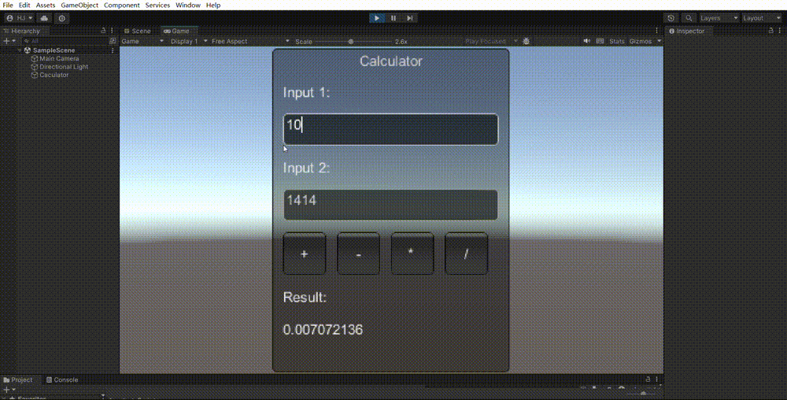
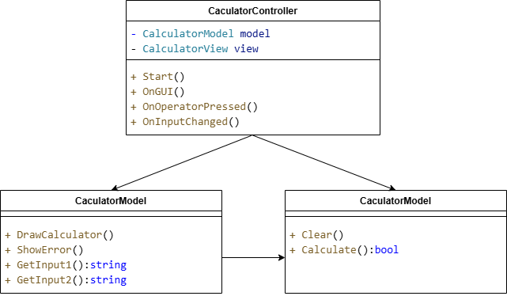

# Lab03 游戏循环和MVC结构：实验报告


### 实验内容

 根据MVC模式，完成一个简单的Unity应用


### 实验结果

##### 展示视频：https://www.bilibili.com/video/BV1wj2mYhESa/?vd_source=d50c805575eb96e9f20a45e57bac270c

<video src="https://www.bilibili.com/video/BV1wj2mYhESa/?vd_source=d50c805575eb96e9f20a45e57bac270c"></video>

 

源代码见`./Scripts/CalculatorController.cs`

有类图如下：



将代码分为 Model-View-Controller (MVC) 结构后，我们可以把逻辑和显示部分拆分为三个独立的类：

1. **Model**：`CalculatorModel` 将负责处理计算逻辑，包括存储输入和执行计算操作。

   ```
   public class CalculatorModel
   {
       // ...
   
       public CalculatorModel(){ Clear();}
   
       public void Clear(){}
   
       public bool Calculate(){
           if(!float.TryParse(input1, out float num1) || !float.TryParse(input2, out float num2)){
               errorMessage = "Invalid Input!";
               return false;
           }
   
           switch (operation){
               case "+":
                   // ...
               case "/":
                   if (num2 != 0)
                       result = num1 / num2;
                   else
                   {
                       errorMessage = "Cannot divide by zero!";
                       return false;
                   }
                   break;
               default:
                   errorMessage = "Invalid operation!";
                   return false;
           }
           return true;
       }
   }
   ```

2. **View**：`CalculatorView` 类负责显示用户界面。它与 `CalculatorController` 交互，等待 Controller 传入计算结果和错误信息。

   ```
   public class CalculatorView{
       // ...
   
       public void DrawCalculator(System.Action<string> onOperatorPressed, System.Action<string> onInputChanged, string result, string errorMessage)
       {
           // ...
   
           GUI.Label(new Rect(centerX + 10, centerY + 30, 200, 30), "Input 1:");
           input1 = GUI.TextField(new Rect(centerX + 10, centerY + 60, 200, 30), input1);
           onInputChanged(input1);
   
           // ...
   
           if (GUI.Button(new Rect(centerX + 10, centerY + 170, 40, 40), "+")) onOperatorPressed("+");
           // ...
   
           if (showError){
               GUI.Label(new Rect(centerX + 10, centerY + 250, 200, 30), errorMessage);
           }else{
               GUI.Label(new Rect(centerX + 10, centerY + 250, 200, 30), result);
           }
       }
   
       public void ShowError(string errorMessage){ showError = true;}
       
       public string GetInput1() => input1;
       public string GetInput2() => input2;
   }
   ```

3. **Controller**：`CalculatorController` 负责协调 Model 和 View 的交互。它将处理输入并触发计算操作。

   ```
   public class CalculatorController : MonoBehaviour
   {
       private CalculatorModel model;
       private CalculatorView view;
   
       void Start(){// ...}
   
       void OnGUI(){// ...}
   
       private void OnOperatorPressed(string operation){
           view.showError = false;
           model.operation = operation;
   
           if (!model.Calculate()){
               view.ShowError(model.errorMessage);
           }
       }
   
       private void OnInputChanged(string input){
           model.input1 = view.GetInput1();
           model.input2 = view.GetInput2();
       }
   }
   ```

   

### 实验总结

进一步熟悉了Unity的操作，对游戏引擎的构建与实现有了更深刻的理解。
